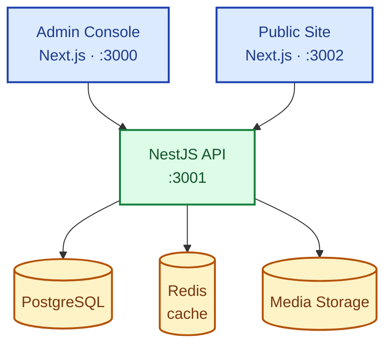
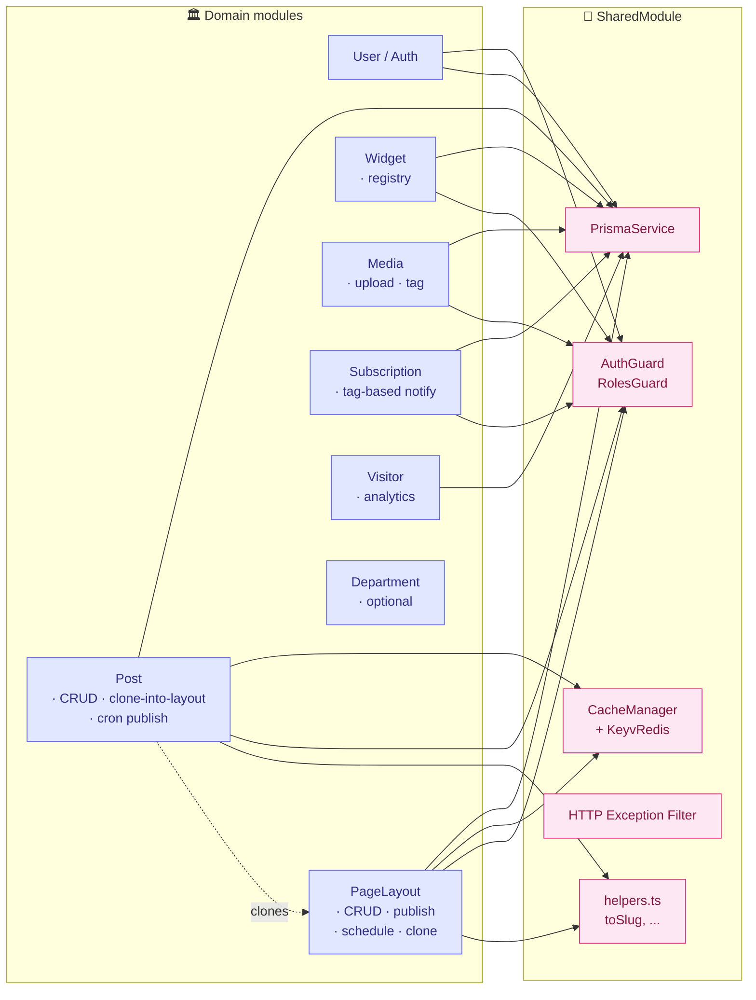
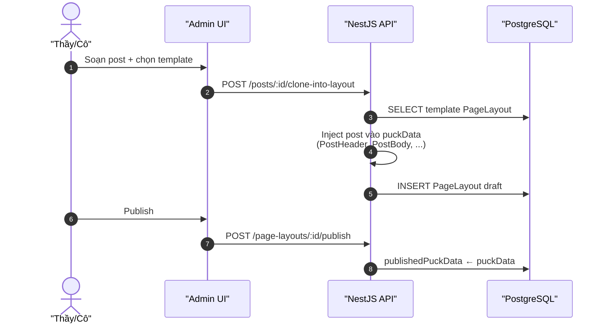
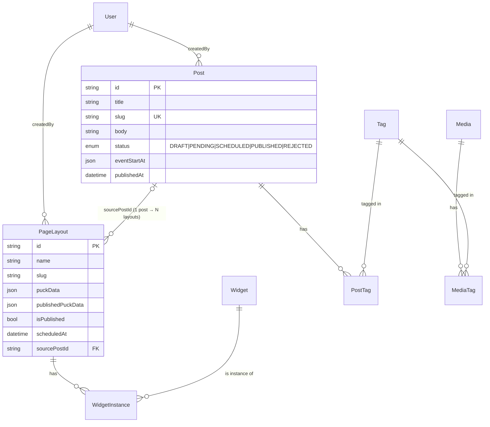

# Kiến trúc hệ thống — Khoa Vật Lý CMS

Tài liệu này gồm 3 sơ đồ:

1. **Topology tổng thể** — ai gọi ai (admin/public/backend/store).
2. **Bên trong NestJS** — các module backend và quan hệ phụ thuộc.
3. **Luồng tạo & xuất bản bài đăng** — pipeline từ form admin → public site.

Mỗi sơ đồ viết bằng cú pháp **Mermaid**, render được trực tiếp trên GitHub / Notion / VS Code (extension "Markdown Preview Mermaid"). Nếu cần export PNG để dán vào Canva, vào `https://mermaid.live` → dán block → tải SVG/PNG.

---

## 1. Topology tổng thể

**Cách đọc:**
- 2 ứng dụng Next.js (admin + public) đều gọi chung **một backend** NestJS.
- Backend là **stateless** — mọi trạng thái lưu ở PostgreSQL hoặc Redis.
- Redis chỉ là **read cache**. Khi có write, NestJS service tự clear cache.
- Cron chạy mỗi phút bên trong process NestJS, không phải service riêng.

---

## 2. Bên trong NestJS — các module và quan hệ

**Cách đọc:**
- `SharedModule` cung cấp Prisma, cache, guards, helpers — mọi module domain đều import.
- Module Domain **không gọi nhau qua HTTP**, chỉ inject service trực tiếp (NestJS DI).
- Mũi tên đứt nét `PostMod -.-> PageLayout` thể hiện quan hệ "Post **clone** template layout của PageLayout khi tạo bản nháp" — không phải dependency cứng.

---

## 3. Luồng tạo bài đăng (post → layout → public URL)

**Cách đọc:**
- Bài đăng là **dữ liệu có cấu trúc** (title, body, tag, ảnh), không phải HTML public trực tiếp.
- Backend **walk cây puckData** của template, thay placeholder (`PostHeader`, `PostBody`, ...) bằng giá trị thật → tạo layout draft mới.
- Khi publish, backend snapshot `puckData` → `publishedPuckData`. Public site đọc snapshot này.
- Sửa post sau đó → `syncAttachedLayouts()` re-inject cho mọi layout có `sourcePostId` trùng.

---

## Phụ lục — Sơ đồ dữ liệu chính (entity simplified)

---

## Export cho slide / Canva

1. Mở `https://mermaid.live`
2. Copy block Mermaid vào panel trái
3. **Actions → PNG** (hoặc SVG để giữ chất lượng vector)
4. Tải file rồi upload lên Canva

Hoặc cài VS Code extension **"Markdown Preview Mermaid Support"** để preview ngay trong file này.
